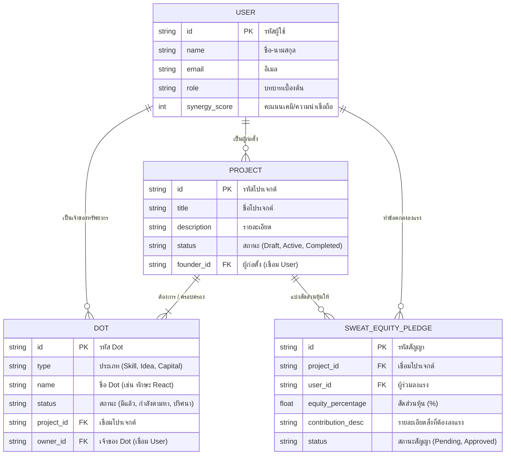

# Core ER Diagram (โครงสร้างฐานข้อมูลหลัก)

## เหตุผลและความสำคัญ
นี่คือกระดูกสันหลังของระบบ (Data Foundation) ก่อนที่เราจะสร้างหน้าจอหรือเขียนตรรกะ AI เราต้องนิยามให้ชัดเจนก่อนว่าแอปพลิเคชันของเราเก็บข้อมูลอะไรบ้าง และแต่ละส่วนเชื่อมโยงกันอย่างไร โครงสร้างนี้จะเป็นตัวกำหนดขอบเขตความสามารถของ MAKE A DOT 

## แผนภาพความสัมพันธ์ (Entity-Relationship)

## คำอธิบาย Data Flow เบื้องต้น
1. **USER (ผู้คน):** ทุกคนเข้ามาในฐานะ User มีคะแนน `synergy_score` สำหรับระบบจับคู่
2. **PROJECT (โปรเจกต์):** User สามารถสร้างโปรเจกต์ได้
3. **DOT (จุดทรัพยากร):** โปรเจกต์หนึ่งๆ จะประกอบไปด้วยหลาย Dots บางดอทมีเจ้าของแล้ว (เช่น Founder มีไอเดีย) บางดอทเป็นของที่กำลังตามหา (Needed) และบางดอทอาจเป็น Mystery Dot ที่ AI แนะนำ
4. **SWEAT EQUITY PLEDGE (สัญญาหุ้น):** เมื่อคนแปลกหน้าเอา Dot (เช่น ทักษะ) มาเติมเต็มให้โปรเจกต์ ระบบจะสร้างข้อตกลงนี้ขึ้นมา เพื่อล็อก % หุ้นให้ตามผลงาน ถือเป็นหัวใจหลักในการป้องกันความขัดแย้ง
